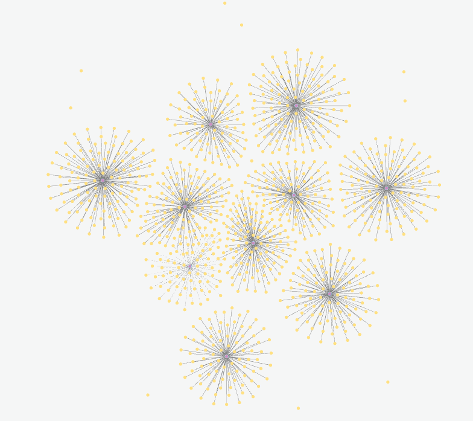
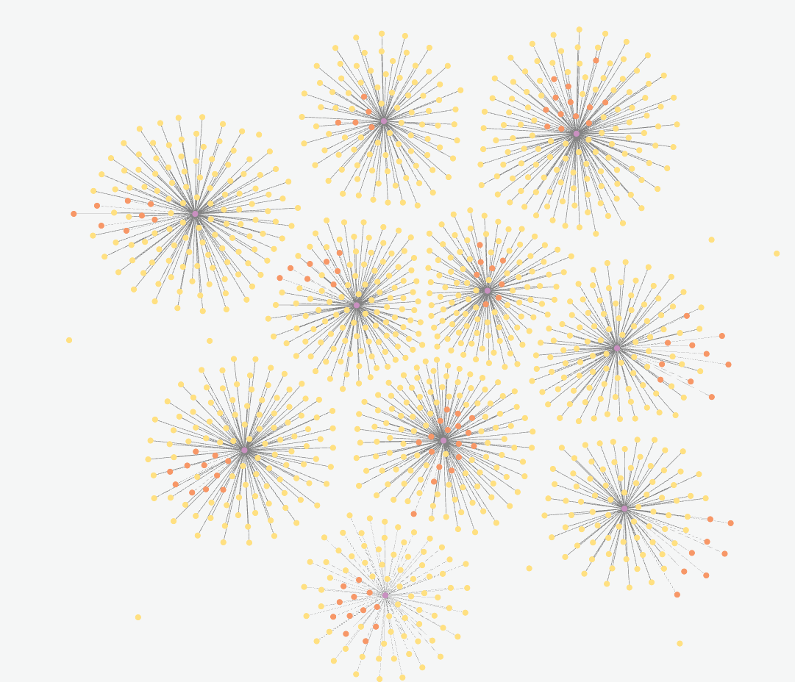
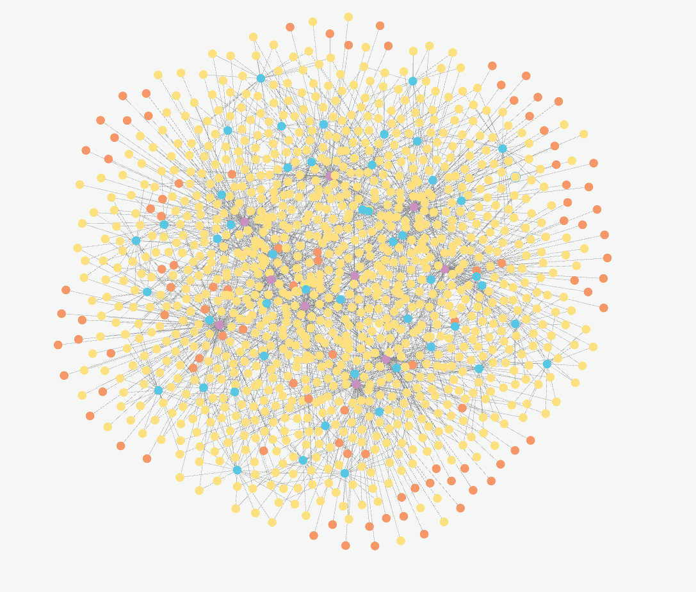
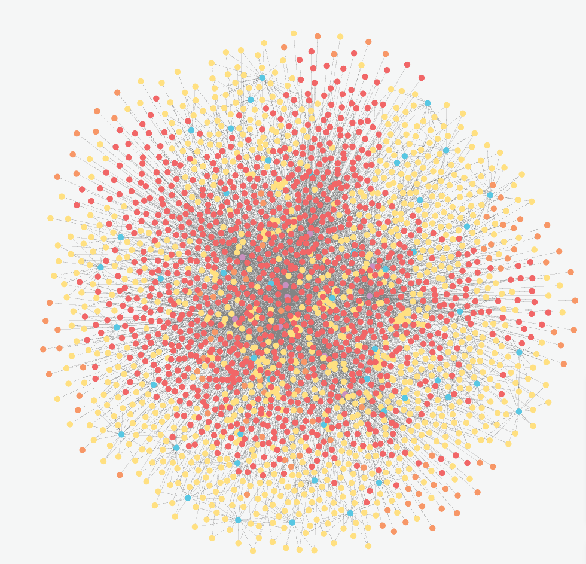
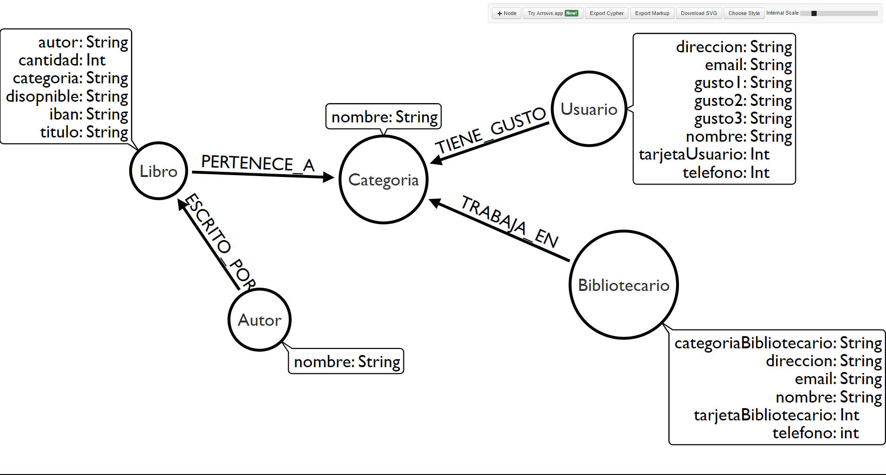

# Creacion de la base de datos de Neo4J
La base de datos ha sido creada de forma manual a base de importaciones CSV y Querrys con la consola que se puede encontrar en la pagina perteneciente a la base de datos. <br>Los CSVs son importados, al igual que el ejercicio anterior de la pagina con spring batch, de la web de Mockaroo, la cual me aporta una cantidad de posibilidades casi infinitas. Estos CSVs han sido usados para la creacion de la base de datos y los objetos de los mismos (nodos para neo4j) son completamente al azar, desde nombres hasta titulos de los libros. <br>

## Links de utilidad para la base de datos

**Grafo de la base de datos**
https://workspace-preview.neo4j.io/workspace/explore

**Neo4J Instance DataBase**
https://console.neo4j.io/?product=aura-db#databases/65bc96ba/detail

## Links a los CSV

- Usuario.csv: https://www.mockaroo.com/e5e409b0
- Bibliotecario.csv: https://www.mockaroo.com/b32ebdd0
- Administrador.csv: https://www.mockaroo.com/eca16b10
- Libro.csv: https://www.mockaroo.com/7e4b1300
- Cliente.csv: https://www.mockaroo.com/c0cebe90
## Querys usadas para la creacion de la base de datos
```markdown
Añadir las Categorías de los Libros

```cypher
CREATE (:Categoria {nombre: 'Ficción'})
CREATE (:Categoria {nombre: 'Misterio'})
CREATE (:Categoria {nombre: 'Romance'})
CREATE (:Categoria {nombre: 'Ciencia Ficción'})
CREATE (:Categoria {nombre: 'Fantasía'})
CREATE (:Categoria {nombre: 'Thriller'})
CREATE (:Categoria {nombre: 'Biografía'})
CREATE (:Categoria {nombre: 'Autoayuda'})
CREATE (:Categoria {nombre: 'Historia'})
CREATE (:Categoria {nombre: 'Cocina'})
```

```markdown
 Crear las Relaciones entre Libros y Categorías

```cypher
CREATE (:Categoria {nombre: 'Ficción'})
CREATE (:Categoria {nombre: 'Misterio'})
CREATE (:Categoria {nombre: 'Romance'})
CREATE (:Categoria {nombre: 'Ciencia Ficción'})
CREATE (:Categoria {nombre: 'Fantasía'})
CREATE (:Categoria {nombre: 'Thriller'})
CREATE (:Categoria {nombre: 'Biografía'})
CREATE (:Categoria {nombre: 'Autoayuda'})
CREATE (:Categoria {nombre: 'Historia'})
CREATE (:Categoria {nombre: 'Cocina'})

WITH 1 as dummy // Puedes utilizar WITH para dividir las fases de la consulta

MATCH (b:Libro), (c:Categoria {nombre: b.categoria})
CREATE (b)-[:PERTENECE_A]->(c)
```

### Visualizacion del grafo despues de esta implementación



```markdown
Crear la relacion entre Bibliotecarios y categorias

```cypher
MATCH (b:Bibliotecario), (c:Categoria {nombre: b.categoriaBibliotecario})
CREATE (b)-[:TRABAJA_EN]->(c)
```

### Visualizacion del grafo con los Libros y Bibliotecarios separados por Categorias



```markdown
Crear la coleccion Autor y sus relaciones con los libros

```cypher
CREATE (:Autor {nombre: 'John Smith'})
CREATE (:Autor {nombre: 'Emily Johnson'})
CREATE (:Autor {nombre: 'Michael Davis'})
CREATE (:Autor {nombre: 'Jessica Wilson'})
CREATE (:Autor {nombre: 'David Anderson'})
CREATE (:Autor {nombre: 'Sarah Thompson'})
CREATE (:Autor {nombre: 'Daniel Martinez'})
CREATE (:Autor {nombre: 'Olivia Taylor'})
CREATE (:Autor {nombre: 'Matthew Thomas'})
CREATE (:Autor {nombre: 'Sophia Hernandez'})
CREATE (:Autor {nombre: 'Andrew Moore'})
CREATE (:Autor {nombre: 'Emma Clark'})
CREATE (:Autor {nombre: 'Joseph Lewis'})
CREATE (:Autor {nombre: 'Ava Lee'})
CREATE (:Autor {nombre: 'Christopher Walker'})
CREATE (:Autor {nombre: 'Mia Hall'})
CREATE (:Autor {nombre: 'Nicholas Young'})
CREATE (:Autor {nombre: 'Abigail King'})
CREATE (:Autor {nombre: 'Joshua Hill'})
CREATE (:Autor {nombre: 'Charlotte Adams'})
CREATE (:Autor {nombre: 'Ethan Baker'})
CREATE (:Autor {nombre: 'Harper Wright'})
CREATE (:Autor {nombre: 'Anthony Garcia'})
CREATE (:Autor {nombre: 'Amelia Mitchell'})
CREATE (:Autor {nombre: 'Ryan Turner'})
CREATE (:Autor {nombre: 'Elizabeth Scott'})
CREATE (:Autor {nombre: 'William Rodriguez'})
CREATE (:Autor {nombre: 'Sofia Green'})
CREATE (:Autor {nombre: 'James White'})
CREATE (:Autor {nombre: 'Grace Harris'})
CREATE (:Autor {nombre: 'Benjamin Martin'})
CREATE (:Autor {nombre: 'Chloe Robinson'})
CREATE (:Autor {nombre: 'David Perez'})
CREATE (:Autor {nombre: 'Victoria Hall'})
CREATE (:Autor {nombre: 'Alexander Turner'})
CREATE (:Autor {nombre: 'Zoe Martinez'})
CREATE (:Autor {nombre: 'Daniel Johnson'})
CREATE (:Autor {nombre: 'Natalie Davis'})
CREATE (:Autor {nombre: 'Josephine Wilson'})
CREATE (:Autor {nombre: 'Henry Anderson'})
CREATE (:Autor {nombre: 'Lily Thompson'})
CREATE (:Autor {nombre: 'Samuel Moore'})
CREATE (:Autor {nombre: 'Ella Clark'})
CREATE (:Autor {nombre: 'Gabriel Lewis'})
CREATE (:Autor {nombre: 'Scarlett Lee'})
CREATE (:Autor {nombre: 'Jackson Walker'})
CREATE (:Autor {nombre: 'Avery Hall'})
CREATE (:Autor {nombre: 'David Young'})
CREATE (:Autor {nombre: 'Madison King'})
CREATE (:Autor {nombre: 'Lucas Hill'})

WITH 1 as dummy
MATCH (a:Autor), (l:Libro {autor: a.nombre})
CREATE (a)-[:ESCRITO_POR]->(l)
```
### Visualizacion de la relacion Autor con sus libros



```markdown

Añado los usuarios, estos tienen 3 gustos cada uno que van relacionados con las categorias de los libros
```cypher
MATCH (u:Usuario)
WITH u, [u.gusto1, u.gusto2, u.gusto3] AS gustos
UNWIND gustos AS gusto
MERGE (c:Categoria {nombre: gusto})
MERGE (u)-[:TIENE_GUSTO]->(c)

```
### Viasualizacion de todas las relaciones hasta ahora de la biblioteca


### Visualizacion gráfica de los nodos

Link:  http://www.apcjones.com/arrows/#
