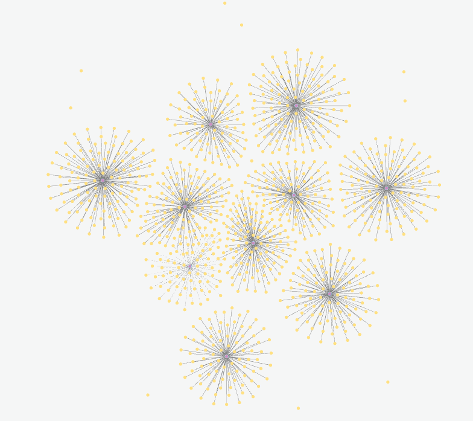

# Ejercicio programacion concurrente con GraphQL de Luis Miguel Urbez

## Paginas de interés

**Grafo de la base de datos**
https://workspace-preview.neo4j.io/workspace/explore

**Neo4J Instance DataBase**
https://console.neo4j.io/?product=aura-db#databases/65bc96ba/detail


## Querys usadas para la creacion de la base de datos
```markdown
Añadir las Categorías de los Libros

```cypher
CREATE (:Categoria {nombre: 'Ficción'})
CREATE (:Categoria {nombre: 'Misterio'})
CREATE (:Categoria {nombre: 'Romance'})
CREATE (:Categoria {nombre: 'Ciencia Ficción'})
CREATE (:Categoria {nombre: 'Fantasía'})
CREATE (:Categoria {nombre: 'Thriller'})
CREATE (:Categoria {nombre: 'Biografía'})
CREATE (:Categoria {nombre: 'Autoayuda'})
CREATE (:Categoria {nombre: 'Historia'})
CREATE (:Categoria {nombre: 'Cocina'})
```

```markdown
 Crear las Relaciones entre Libros y Categorías

```cypher
CREATE (:Categoria {nombre: 'Ficción'})
CREATE (:Categoria {nombre: 'Misterio'})
CREATE (:Categoria {nombre: 'Romance'})
CREATE (:Categoria {nombre: 'Ciencia Ficción'})
CREATE (:Categoria {nombre: 'Fantasía'})
CREATE (:Categoria {nombre: 'Thriller'})
CREATE (:Categoria {nombre: 'Biografía'})
CREATE (:Categoria {nombre: 'Autoayuda'})
CREATE (:Categoria {nombre: 'Historia'})
CREATE (:Categoria {nombre: 'Cocina'})

WITH 1 as dummy // Puedes utilizar WITH para dividir las fases de la consulta

MATCH (b:Libro), (c:Categoria {nombre: b.categoria})
CREATE (b)-[:PERTENECE_A]->(c)
```

## Visualizacion del grafo despues de esta implementación



# Sistema de Administración de Biblioteca en Línea con GraphQL y Programación Concurrente

Este proyecto tiene como objetivo diseñar y desarrollar un sistema de administración de biblioteca en línea utilizando GraphQL y técnicas de programación concurrente.Este sistema permitirá a los usuarios buscar libros, autores y categorías de libros. Además, los usuarios podrán hacer reservas y pedir prestados libros electrónicamente. Los administradores podrán agregar, editar y eliminar libros, autores y categorías.

## Funcionalidades Implementadas

### 1. Buscar Libros

- Los usuarios pueden buscar libros por título, autor o categoría utilizando consultas GraphQL.
- El sistema responde a estas consultas obteniendo datos de la base de datos mediante GraphQL.

### 2. Gestionar Reservas y Préstamos

- Los usuarios pueden hacer reservas y pedir prestados libros electrónicamente.
- Se utiliza programación concurrente para manejar eficientemente múltiples solicitudes.

### 3. Gestionar Libros, Autores y Categorías

- Los administradores pueden agregar, editar y eliminar libros, autores y categorías.
- Mutaciones de GraphQL se utilizan para realizar estas operaciones en la base de datos.

### 4. Interfaz de Usuario

- Se proporciona una interfaz de usuario fácil de usar para que tanto usuarios como administradores interactúen con el sistema.

### 5. Pruebas

- Se implementan pruebas que cubren consultas y mutaciones de GraphQL.
- Las pruebas abarcan la lógica de programación concurrente y la funcionalidad de la interfaz de usuario.

## Rúbrica del Ejercicio

### Implementación de consultas de GraphQL (30%)

La aplicación debe utilizar correctamente GraphQL para realizar consultas a la base de datos. Cada consulta debe devolver los datos esperados y manejar adecuadamente los errores.

### Implementación de mutaciones de GraphQL (20%)

La aplicación debe utilizar correctamente GraphQL para realizar mutaciones en la base de datos. Cada mutación debe modificar los datos como se esperaba y manejar adecuadamente los errores.

### Uso de la programación concurrente (20%)

La aplicación debe utilizar programación concurrente para manejar múltiples solicitudes de manera eficiente. Debe demostrar que la programación concurrente mejora la eficiencia de la aplicación.

### Interfaz de usuario (10%)

La interfaz de usuario debe ser fácil de usar y permitir a los usuarios y administradores interactuar con la aplicación. Debe implementar correctamente todas las funcionalidades requeridas.

### Pruebas (20%)

Se deben implementar pruebas que cubran todas las funcionalidades de la aplicación. Las pruebas deben ser completas y pasar correctamente.

La nota final se calculará según estos criterios y se proporcionará un feedback detallado en cada uno de ellos.
